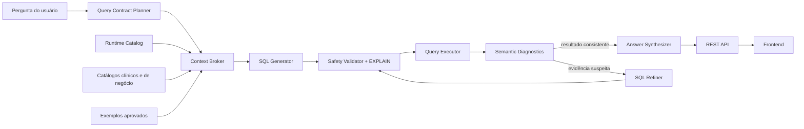

# Plano de Implementação: Agente Text-to-SQL Robusto e Generalizável

## 1. Identificação

- Status: planejado
- Projeto: Datasus Health System Chatbot
- Framework central: Pydantic AI
- Banco analítico: DuckDB SIH/SUS
- Baseline de código: commit `dd970e3`
- Baseline de testes automatizados: 161 testes passando
- Baseline hard atual: 77 perguntas, 72 acertos automatizados do Full Agent
- Baseline hard semanticamente adjudicado: 75/77, considerando GT115, GT125 e GT129 como falsos negativos ou contratos ambíguos
- Benchmark de referência: `evaluation/chatbot/results/hard77_full_vs_api_20260709_203549`

## 2. Objetivo geral

Evoluir o agente para interpretar perguntas sobre o banco de forma generalizável, produzir SQL correta, executar com segurança, corrigir resultados suspeitos e responder em linguagem natural, sem depender de listas rígidas de palavras, regras específicas para perguntas conhecidas ou exemplos vazados do conjunto de avaliação.

A solução deve separar claramente:

1. interpretação semântica da pergunta;
2. evidências obtidas do banco real;
3. contrato esperado da consulta e da resposta;
4. geração e execução de SQL;
5. diagnóstico semântico e autocorreção;
6. apresentação ao usuário final;
7. avaliação reprodutível e sem vazamento.

## 3. Resultado esperado

Ao final da implementação, o sistema deverá:

- distinguir filtros de limiar de rankings sem depender da presença isolada de palavras como `mais`;
- determinar se o resultado deve ser escalar, top-k, distribuição, série temporal, lista completa ou preview;
- decidir quando códigos, descrições ou ambos são necessários;
- usar metadados e cobertura do DuckDB conectado, invalidando artefatos obsoletos;
- evitar joins que eliminem o universo analítico sem intenção explícita;
- identificar dimensões vazias, cobertura temporal incompleta e relacionamentos parciais;
- executar apenas SQL read-only em ambiente controlado;
- usar feedback de execução para corrigir SQL tecnicamente válida, mas semanticamente suspeita;
- preservar o contrato original durante refinamentos;
- paginar resultados extensos sem alterar a semântica da consulta;
- produzir ao usuário apenas uma resposta amigável, mantendo SQL e diagnóstico no modo debug;
- continuar suportando contexto conversacional, catálogo CID, procedimentos, gráficos, API REST e frontend;
- ser avaliado sem recuperar a própria pergunta ou SQL de ground truth como exemplo few-shot.

## 4. Princípios de arquitetura

### 4.1 Evidência em vez de regras específicas

Decisões sobre joins, dimensões e cobertura devem vir de perfis estruturados do banco real. Não devem existir regras como `se hospital, sempre faça JOIN hospital` ou `se aparecer mais, use LIMIT 20`.

### 4.2 Contratos tipados em vez de interpretação implícita

A intenção analítica deve ser representada por modelos Pydantic. O gerador, o refiner, o executor e o avaliador devem compartilhar o mesmo contrato.

### 4.3 Segurança bloqueia; semântica orienta

Somente violações de segurança devem bloquear definitivamente uma consulta. Incertezas semânticas devem produzir evidências, warnings e uma oportunidade de autocorreção.

### 4.4 Preservação de grão

Todo join deve declarar seu efeito esperado no grão e no universo. Dimensões usadas apenas para descrição não podem reduzir silenciosamente a tabela fato.

### 4.5 Completude é uma decisão semântica

`LIMIT` pertence à intenção do usuário. Limites de transporte e UI devem ser implementados como paginação ou truncamento explícito, sem modificar a SQL semântica.

### 4.6 Avaliação sem data leakage

Nenhum item avaliado pode recuperar seu próprio ID, pergunta normalizada ou paráfrase equivalente como exemplo few-shot.

### 4.7 Mudanças incrementais e reversíveis

Cada componente novo deve ser introduzido atrás de feature flag, validado em shadow mode e removido somente depois de demonstrar paridade ou ganho.

## 5. Arquitetura alvo



Pydantic AI continuará sendo o framework central. A arquitetura não exige uma rede de agentes autônomos. Serão utilizados papéis tipados e ferramentas determinísticas:

- `QueryContractPlanner`: transforma a pergunta em contrato estruturado;
- `SQLGenerator`: gera a SQL com base no contrato e nas evidências;
- `SQLRefiner`: corrige apenas quando recebe diagnóstico relevante;
- `AnswerSynthesizer`: produz a resposta final amigável;
- tools determinísticas: inspecionam catálogo, cobertura e execução.

## 6. Contratos de dados

### 6.1 QueryContract

Criar um modelo Pydantic imutável que represente a semântica interpretada:

```python
class QueryContract(BaseModel):
    question: str
    grain: str
    metrics: list[MetricSpec]
    dimensions: list[DimensionSpec]
    filters: list[FilterSpec]
    threshold_filters: list[ThresholdFilterSpec]
    ranking: RankingSpec | None
    temporal_scope: TemporalScope | None
    output: OutputContract
    assumptions: list[str]
    unresolved_ambiguities: list[str]
    confidence: Literal["low", "medium", "high"]
```

O `OutputContract` deverá declarar:

- campos obrigatórios;
- campos opcionais;
- modo `scalar`, `top_k`, `distribution`, `time_series`, `exhaustive_list` ou `preview`;
- ordenação semanticamente relevante;
- política de empate;
- se o resultado deve ser completo;
- limite solicitado pelo usuário, quando houver;
- tolerância de arredondamento.

### 6.2 RuntimeCatalogSnapshot

Criar um snapshot versionado do banco real:

```python
class RuntimeCatalogSnapshot(BaseModel):
    database_fingerprint: str
    generated_at: datetime
    tables: dict[str, TableProfile]
    joins: dict[str, JoinProfile]
    date_coverages: dict[str, DateCoverageProfile]
```

Cada `TableProfile` deverá conter, no mínimo:

- quantidade de linhas;
- quantidade de colunas;
- chaves candidatas;
- distinct count das chaves relevantes;
- null rate;
- min/max para campos temporais e numéricos relevantes;
- estado `available`, `empty`, `missing` ou `stale`.

Cada `JoinProfile` deverá conter:

- lado esquerdo e direito;
- cardinalidade esperada;
- linhas e chaves cobertas;
- taxa de correspondência;
- quantidade de órfãos;
- risco de duplicação;
- timestamp e fingerprint do banco usado no cálculo.

### 6.3 SemanticDiagnostic

Padronizar os sinais enviados ao refiner:

- `empty_result_unexpected`;
- `join_coverage_loss`;
- `grain_changed`;
- `required_field_missing`;
- `unexpected_limit`;
- `result_truncated`;
- `temporal_coverage_loss`;
- `cardinality_outlier`;
- `unsafe_sql`;
- `execution_error`;
- `timeout`.

Cada diagnóstico deve carregar evidência, severidade e recomendação, mas não uma SQL hardcoded.

## 7. Organização de código proposta

Evitar uma refatoração ampla de uma só vez. Introduzir módulos pequenos e com responsabilidade única:

```text
src/health_system_chatbot/
  query_contract.py
  query_contract_planner.py
  runtime_catalog.py
  runtime_catalog_store.py
  context_broker.py
  semantic_diagnostics.py
  query_execution.py
  tools/
    catalog_tools.py
    metadata_tools.py
```

Módulos existentes devem ser adaptados:

- `workflow.py`: orquestra o novo fluxo;
- `schema_context.py`: delega seleção ao `ContextBroker`;
- `context_retrieval.py`: continua fornecendo métricas e contexto de negócio;
- `sql_generator.py`: deixa de inferir shape por tokens;
- `sql_validator.py`: separa segurança de semântica;
- `self_correction.py`: preserva `QueryContract`;
- `duckdb_executor.py`: implementa timeout real, paginação e diagnósticos;
- `evaluation/chatbot/*`: passa a avaliar pelo contrato.

## 8. Checkpoints de implementação

### Checkpoint 0: congelar baseline e garantir reprodutibilidade

#### Implementação

- Registrar commit, modelo, banco, fingerprint, configuração e dataset em todo run.
- Preservar o benchmark hard atual e suas 154 execuções.
- Criar um comando de rescore que reutilize SQLs geradas sem novas chamadas à API.
- Persistir trace incrementalmente após cada item.
- Implementar retomada por ID para runs interrompidos.
- Registrar SQL inicial, SQL refinada e motivo de cada alteração.
- Fazer `result_match_rate` usar o total end-to-end; manter métrica comparável separada.

#### Validação

- Reproduzir as métricas do run hard atual a partir do trace.
- Confirmar que uma SQL inválida conta como erro end-to-end.
- Interromper e retomar um run artificial sem perder registros.

#### Critério de saída

- Benchmark reproduzível sem chamar a LLM novamente.
- Nenhum segredo armazenado nos artefatos.
- Trace parcial válido mesmo em encerramento abrupto.

### Checkpoint 1: corrigir integridade do ground truth e do avaliador

#### Implementação

- Adicionar `OutputContract` aos itens de avaliação.
- Definir campos obrigatórios e opcionais.
- Implementar política explícita de empate.
- Diferenciar resultado completo, top-k e preview.
- Remover premissas ocultas que não aparecem na pergunta.
- Corrigir ou marcar itens cuja dimensão auxiliar reduz o universo sem explicação.
- Criar categoria `ground_truth_ambiguous` sem contabilizá-la como erro do agente até adjudicação.

#### Casos obrigatórios

- GT115: aceitar qualquer CNES pertencente ao conjunto empatado na maior receita.
- GT125: explicitar se a análise inclui 2007 ou se usa apenas cobertura da dimensão `tempo`.
- GT129: alinhar pergunta e contrato sobre top 10, descrição e completude.
- GT214: marcar o resultado como lista completa, não top 20.

#### Validação

- Executar cada ground truth diretamente no DuckDB.
- Validar cobertura temporal e cardinalidade.
- Exigir desempate determinístico ou conjunto de respostas válidas.
- Revisar `data_quality_notes` contra os resultados atuais.

#### Critério de saída

- Nenhuma pergunta possui limite, filtro ou denominador oculto.
- Empates não geram falsos negativos.
- O avaliador distingue incompletude de coluna extra válida.

### Checkpoint 2: implementar Runtime Catalog

#### Implementação

- Calcular fingerprint do DuckDB.
- Coletar perfis de tabelas, colunas e relacionamentos.
- Invalidar `join_policy.csv` quando o fingerprint não corresponder ao banco atual.
- Marcar tabelas vazias e indisponíveis.
- Persistir snapshot em cache local ignorado pelo Git.
- Recalcular apenas perfis afetados quando possível.
- Carregar o snapshot no `Stage1Context`.

#### Casos obrigatórios

- `hospital` deve ser identificado como `empty` com zero linhas.
- `internacoes.CNES -> hospital.CNES` deve ter cobertura zero no banco atual.
- `tempo` deve informar cobertura de 2008-01-01 a 2023-12-31.
- O catálogo deve identificar datas de `internacoes.DT_INTER` fora dessa cobertura.

#### Validação

- Comparar perfis salvos com consultas diretas ao DuckDB.
- Alterar um banco de teste e verificar invalidação do snapshot.
- Testar dimensões vazias, parciais, duplicadas e completas.

#### Critério de saída

- Nenhuma política de join obsoleta é enviada à LLM.
- Toda tabela recuperada possui estado runtime conhecido.
- Perfis carregam fingerprint e timestamp.

### Checkpoint 3: implementar Query Contract Planner

#### Implementação

- Criar agente Pydantic AI com output `QueryContract`.
- Separar threshold, ranking e limite solicitado.
- Identificar campos pedidos, opcionais e auxiliares.
- Identificar código versus descrição.
- Identificar completude esperada.
- Representar incerteza sem bloquear o Text-to-SQL.
- Registrar o contrato no trace e no debug.

#### Proibições

- Não usar listas de palavras para decidir ranking.
- Não codificar tratamento específico para GT115, GT118, GT125, GT129 ou GT214.
- Não gerar SQL nessa etapa.
- Não usar o ground truth como ferramenta de planejamento em produção.

#### Validação

- Testar pares de paráfrases semanticamente equivalentes.
- Testar frases parecidas com semântica distinta.
- Verificar estabilidade do contrato em múltiplas execuções.
- Avaliar campos estruturados, não texto livre de reasoning.

#### Casos mínimos

- `CNES com mais de 5000 internações`: threshold, sem top-k.
- `20 CNES com mais internações`: ranking, top-k igual a 20.
- `Quais códigos CID aparecem`: código obrigatório, descrição opcional, sem limite implícito.
- `10 hospitais com mais de 1000 internações`: threshold e top-k coexistem.

#### Critério de saída

- Acurácia de classificação de contrato igual ou superior a 95% no conjunto adjudicado.
- Zero decisões de ranking baseadas apenas no token `mais`.

### Checkpoint 4: implementar Context Broker e retrieval híbrido

#### Implementação

- Usar o `QueryContract` para orientar retrieval.
- Separar identificadores snake_case em tokens semânticos.
- Remover stopwords do scoring lexical.
- Combinar busca lexical, metadados estruturados e embeddings.
- Incluir perfis runtime e caveats relevantes.
- Garantir que exemplos só referenciem tabelas disponíveis.
- Excluir o item atual e equivalentes durante avaliação.
- Aplicar diversidade aos exemplos para evitar quatro variações do mesmo padrão.

#### Validação

- `dia da semana` deve recuperar `tempo` e `internacoes`.
- Pergunta por CID deve recuperar `cid`, `internacoes` e candidatos clínicos relevantes.
- Pergunta por procedimento principal não deve recuperar tabela inexistente.
- Tabela vazia pode ser recuperada como evidência, mas deve vir marcada como vazia.

#### Critério de saída

- Recall de tabelas necessárias igual ou superior ao baseline atual.
- Nenhum exemplo exato vazado em runs leave-one-out.
- Redução de tabelas irrelevantes sem perda das necessárias.

### Checkpoint 5: tools genéricas de inspeção e planejamento de joins

#### Implementação

- Criar `inspect_table`.
- Criar `inspect_join`.
- Criar `inspect_column_coverage`.
- Criar `inspect_date_coverage`.
- Criar `sample_distinct_values` com limite e timeout.
- Expor as tools ao agente via `ChatDeps`.
- Registrar chamadas, argumentos, resultados resumidos e latência.
- Servir preferencialmente dados do snapshot cacheado.

#### Regras gerais

- A tool fornece evidência, não escolhe a SQL.
- Joins descritivos devem declarar cobertura.
- Join com cobertura zero nunca pode parecer confirmado.
- Relação many-to-many deve sinalizar risco de mudança de grão.

#### Validação

- Testar cobertura zero, parcial e total.
- Testar duplicação de linhas por dimensão não única.
- Testar erro e timeout da tool sem derrubar o workflow.

#### Critério de saída

- GT118 não utiliza `INNER JOIN hospital` no banco atual.
- O agente justifica joins com evidência rastreável.

### Checkpoint 6: refatorar geração, validação e autocorreção

#### Implementação

- Remover `_shape_guidance` baseado em tokens após paridade do planner.
- Remover validações semânticas duplicadas do `sql_validator.py`.
- Manter hard block apenas para segurança.
- Usar SQLGlot para AST, escopo de CTEs, aliases e colunas.
- Executar `EXPLAIN` antes da consulta real.
- Passar `QueryContract` imutável ao gerador e ao refiner.
- Proibir o refiner de alterar campos obrigatórios, completude e top-k sem diagnóstico correspondente.
- Gerar múltiplas candidatas apenas quando contrato ou evidências indicarem baixa confiança.

#### Diagnósticos que podem acionar refiner

- resultado vazio inesperado;
- perda de cobertura por join;
- limite incompatível com resultado completo;
- ausência de campo obrigatório;
- mudança de grão;
- erro de execução;
- referência inexistente;
- resultado truncado quando completude for necessária.

#### Validação

- SQL com CTE válida não deve acionar refiner por falso positivo de coluna ambígua.
- Refiner deve preservar shape e contrato.
- SQL executável com resultado zero suspeito deve receber uma tentativa de revisão.
- Warnings semânticos não devem bloquear uma pergunta futura válida.

#### Critério de saída

- GT115 não sofre reescrita por falso positivo do validator.
- GT118 corrige o join após diagnóstico de cobertura ou zero inesperado.
- GT214 não recebe `LIMIT` sem top-k no contrato.

### Checkpoint 7: execução controlada, timeout real e paginação

#### Implementação

- Executar consultas em worker isolado ou mecanismo que permita interrupção real.
- Cancelar consulta ao exceder timeout, sem apenas medir depois.
- Aplicar limites de memória e threads.
- Manter conexão DuckDB read-only.
- Separar SQL semântica de limite de transporte.
- Implementar cursor ou paginação para resultados grandes.
- Retornar `truncated`, `next_cursor`, `row_count` e hash do resultado.
- Permitir ao Answer Synthesizer receber resumo sem carregar milhares de linhas.

#### Validação

- Consulta artificialmente lenta deve ser interrompida.
- Consulta completa com 471 linhas não deve virar top 20.
- UI deve mostrar primeira página sem alterar a resposta analítica.
- Paginação deve ser estável e determinística.

#### Critério de saída

- Nenhuma consulta permanece indefinidamente em execução.
- Nenhum limite técnico muda a semântica da pergunta.

### Checkpoint 8: avaliador orientado por contrato

#### Implementação

- Comparar campos obrigatórios independentemente de aliases.
- Aceitar colunas opcionais adicionais.
- Avaliar top-k com política de empate.
- Exigir completude quando `output.mode=exhaustive_list`.
- Permitir subconjunto somente em `preview` ou paginação declarada.
- Normalizar tipos, acentos, caixa e flexões semânticas conservadoras.
- Manter tolerância numérica e arredondamento explícitos.
- Distinguir erro do agente, erro do evaluator, ground truth ambíguo e erro de ambiente.
- Relatar end-to-end accuracy sobre o total.

#### Validação

- Extra column não deve causar falso negativo.
- Linha faltante em lista completa deve continuar sendo erro.
- Empate válido deve ser aceito.
- Label equivalente deve ser aceito e auditado.
- SQL inválida deve contar como erro end-to-end.

#### Critério de saída

- Os cinco casos investigados recebem classificação coerente e explicável.
- Nenhuma tolerância ampla permite aceitar valores incorretos.

### Checkpoint 9: integração, rollout e remoção do legado

#### Implementação

- Adicionar feature flags:
  - `QUERY_CONTRACT_ENABLED`;
  - `RUNTIME_CATALOG_ENABLED`;
  - `SEMANTIC_DIAGNOSTICS_ENABLED`;
  - `CONTRACT_AWARE_EVALUATION_ENABLED`.
- Executar shadow mode comparando SQL antiga e nova.
- Medir divergências e adjudicar amostra.
- Ativar progressivamente por ambiente.
- Remover heurísticas antigas somente após os gates.
- Atualizar README, arquitetura, configuração e runbook.

#### Critério de saída

- Pipeline novo ativo por padrão.
- Fallback documentado e temporário.
- Nenhum código duplicado entre fluxo antigo e novo.
- Feature flags antigas removidas após estabilização.

## 9. Plano de testes obrigatório

### 9.1 Testes das cinco questões investigadas

#### GT115: maior receita por especialidade

- Validar top-1 por especialidade.
- Validar HAVING de mais de 500 internações.
- Validar 120 candidatos empatados na especialidade problemática.
- Aceitar qualquer candidato pertencente ao conjunto empatado.
- Aceitar colunas opcionais adicionais.
- Garantir que refiner preserve o contrato.
- Garantir que dimensão `hospital` vazia não elimine linhas.

#### GT118: hospitais sem UTI

- Validar os dez CNES esperados.
- Garantir ausência de `INNER JOIN` com dimensão de cobertura zero.
- Testar alternativa sem dimensão e alternativa com `LEFT JOIN`.
- Simular tabela hospital completa e verificar uso seguro da descrição.
- Confirmar autocorreção quando o primeiro resultado for zero de forma suspeita.

#### GT125: distribuição de UTI por dia da semana

- Validar recuperação de `tempo` e `internacoes`.
- Validar cobertura de 2007 separadamente.
- Testar contrato que usa todas as datas da fato.
- Testar contrato explicitamente restrito à dimensão calendário.
- Validar mapeamento Monday-Sunday e Sunday-Saturday.
- Validar total e percentuais com tolerância definida.

#### GT129: códigos CID em óbitos

- Validar `MORTE = TRUE` e `DIAG_PRINC`.
- Validar que código é obrigatório quando solicitado.
- Validar descrição como opcional quando não solicitada.
- Validar lista completa sem limite implícito.
- Validar variante explícita `top 10` com limite.
- Confirmar que os dez primeiros códigos e contagens continuam corretos.

#### GT214: CNES acima das médias

- Validar threshold `COUNT(*) > 5000`.
- Validar custo médio e taxa de mortalidade acima das médias gerais.
- Garantir ausência de `LIMIT` no modo completo.
- Validar paginação das 471 linhas.
- Testar paráfrase com `20 maiores CNES`, que deve gerar top-k.
- Confirmar que arredondamento não altera filtros.

### 9.2 Regressões históricas obrigatórias

- GT114: pergunta obstétrica com contraceptivo não pode ser bloqueada por intent.
- GT213: `eletiva` e `Eletivo` devem ser semanticamente equivalentes.
- GT021 e GT068: procedimento principal usa `internacoes.PROC_REA`, sem tabela inexistente.
- GT078: motivos de internação por faixa etária usam CID, não caráter de internação.
- GT081 e GT227: ranking de procedimentos por sexo e faixa preserva top-k por grupo.
- GT116 e GT127: crescimento e queda entre períodos preservam filtros e direção da métrica.
- GT122: percentual acumulado de procedimentos preserva janela e grão.
- GT131: pacientes indígenas usam a dimensão/campo correto e tipo compatível.
- GT196: parto cesariano usa a definição clínica esperada para a pergunta.
- GT207: custos de UTI em óbitos preservam filtro de morte e diagnóstico principal.
- GT210 e GT211: capítulos CID preservam grão e denominador.
- GT234: percentil 99 não pode ser confundido com ranking textual simples.

### 9.3 Perguntas clínicas e CID adicionadas como regressão

Adicionar casos validados diretamente no DuckDB para:

- mortes por câncer usando CID de neoplasia maligna;
- mortes por infecções por cidade, sexo, idade e ano;
- diferentes doenças com código único, prefixo, categoria, grupo e capítulo CID;
- doença com nome ambíguo e múltiplos candidatos de catálogo;
- termo clínico inexistente no catálogo;
- diagnóstico principal versus diagnóstico secundário;
- pergunta que pede somente código;
- pergunta que pede código e descrição;
- pergunta que pede top-k;
- pergunta que pede lista completa.

Os códigos e resultados devem vir do catálogo real e de SQL ground truth revisada. Não adicionar mapeamentos específicos ao prompt para fazer esses testes passarem.

### 9.4 Testes de joins e qualidade de dados

- dimensão vazia;
- dimensão com cobertura parcial;
- dimensão com chave duplicada;
- join many-to-many;
- órfãos na tabela fato;
- LEFT JOIN com descrição opcional;
- INNER JOIN explicitamente solicitado para universo mapeado;
- tabela ausente no runtime;
- artefato de join com fingerprint antigo;
- geografia de residência versus geografia do hospital;
- dimensão temporal com cobertura incompleta.

### 9.5 Testes do Query Contract

- threshold versus ranking;
- ranking global versus ranking por grupo;
- top-k explícito versus lista completa;
- escalar versus distribuição;
- taxa versus contagem;
- código versus descrição;
- filtro constante que não deve aparecer na saída;
- campos auxiliares opcionais;
- empate permitido;
- período explícito e implícito;
- paráfrases com mesma semântica;
- sentenças lexicalmente próximas com semântica diferente.

### 9.6 Testes de autocorreção

- erro de sintaxe;
- coluna inexistente;
- falso positivo de coluna em CTE;
- join de cobertura zero;
- resultado vazio inesperado;
- limite incompatível com completude;
- alteração indevida de shape pelo refiner;
- correção que introduz nova tabela;
- duas tentativas sem sucesso;
- tool indisponível;
- timeout de execução.

### 9.7 Testes de API e resposta final

- `POST /api/chat` com pergunta escalar;
- distribuição e série temporal;
- contexto conversacional;
- pergunta anteriormente classificada como ambígua deve seguir para Text-to-SQL;
- resposta sem SQL e detalhes técnicos quando debug estiver desligado;
- SQL, trace, tools e diagnósticos somente quando debug estiver ligado;
- erro seguro sem stack trace para usuário;
- paginação e `truncated`;
- timeout e cancelamento;
- health check e carregamento do frontend.

### 9.8 Testes de gráficos

- pergunta normal não deve gerar gráfico;
- pedido explícito de gráfico deve gerar `ChartPlan` válido;
- série temporal deve renderizar corretamente;
- ranking deve renderizar corretamente;
- dados vazios não devem quebrar a UI;
- paginação não deve produzir gráfico inconsistente;
- falha de renderização não deve invalidar a resposta textual;
- frontend deve continuar exibindo debug apenas quando habilitado.

### 9.9 Testes do frontend

- envio de pergunta e estado de loading;
- resposta normal amigável;
- botão e painel de debug;
- exibição opcional de SQL;
- renderização de tabela;
- renderização de gráfico;
- erro de API;
- retry;
- viewport desktop e mobile;
- ausência de overlap e overflow;
- título e identidade visual existentes;
- histórico da conversa.

### 9.10 Testes não funcionais

- timeout real de consulta;
- limite de memória;
- conexão read-only;
- proteção contra SQL destrutiva;
- ausência de secrets em logs e artefatos;
- latência p50 e p95;
- custo e tokens por etapa;
- tamanho máximo de contexto;
- retomada de benchmark interrompido;
- cache invalidado por fingerprint;
- concorrência de múltiplas requisições.

## 10. Estratégia de avaliação

### 10.1 Suites separadas

Manter suites com objetivos distintos:

1. `unit`: determinística, sem LLM e sem banco grande;
2. `duckdb_integration`: SQL e tools contra banco real ou fixture representativa;
3. `targeted_failures`: GT115, GT118, GT125, GT129 e GT214;
4. `historical_regression`: casos já corrigidos anteriormente;
5. `hard_compatibility`: todas as 77 perguntas hard com configuração atual;
6. `hard_leave_one_out`: mesmas perguntas sem exemplo exato ou equivalente;
7. `full_ground_truth`: todos os 228 itens validados;
8. `api_e2e`: fluxo completo REST;
9. `frontend_e2e`: UI, debug, tabela e gráfico;
10. `ablation`: remoção controlada de cada componente.

### 10.2 Leave-one-out obrigatório

Ao avaliar um item:

- excluir o mesmo ID;
- excluir pergunta normalizada idêntica;
- excluir paráfrase marcada como equivalente;
- registrar IDs dos exemplos efetivamente recuperados;
- falhar o teste se houver vazamento.

### 10.3 Testes metamórficos

Para uma mesma intenção, gerar paráfrases que devem produzir o mesmo contrato e resultado:

- alterar ordem das palavras;
- trocar singular e plural;
- usar sinônimos;
- explicitar ou omitir palavras de cortesia;
- trocar `acima de` por `maior que`;
- trocar `top 10` por `dez maiores`.

Também criar pares negativos que não podem ser tratados como equivalentes:

- `mais de 5000 internações` versus `5.000 maiores hospitais`;
- `códigos CID` versus `descrições CID`;
- `município de residência` versus `município do hospital`;
- `diagnóstico principal` versus `qualquer diagnóstico`;
- `lista completa` versus `top 20`.

## 11. Gates de qualidade e não regressão

Nenhuma fase será considerada concluída apenas porque os cinco casos passam.

### Gate A: código

- todos os testes existentes continuam passando;
- novos testes unitários e de integração passam;
- `compileall` passa;
- `git diff --check` passa;
- não há duplicação de regra semântica entre planner, generator e validator;
- módulos novos possuem responsabilidade única e contratos tipados.

### Gate B: segurança

- 100% das consultas permanecem read-only;
- testes destrutivos são bloqueados;
- timeout interrompe execução real;
- nenhuma credencial aparece em trace, relatório ou log.

### Gate C: targeted failures

- GT115, GT118, GT125, GT129 e GT214 passam sob contratos adjudicados;
- cada caso possui teste unitário da causa e teste end-to-end;
- nenhuma correção referencia o ID da questão em código de produção.

### Gate D: regressão funcional

- nenhum item anteriormente correto no hard set passa a falhar sem adjudicação documentada;
- GT114 e GT213 continuam corretos;
- catálogo CID e procedimentos mantêm ou melhoram suas métricas;
- respostas sem gráfico continuam funcionando;
- geração de gráfico continua funcionando quando solicitada;
- API e frontend passam em desktop e mobile.

### Gate E: generalização

- leave-one-out não recupera exemplos vazados;
- o novo Full Agent melhora o baseline leave-one-out anterior;
- não há ganho restrito somente às cinco perguntas conhecidas;
- resultados se mantêm em paráfrases e famílias semânticas não usadas no desenvolvimento.

### Gate F: performance

- registrar p50 e p95 por etapa;
- impedir regressão de latência superior ao orçamento aprovado;
- tool calls extras devem ocorrer somente quando necessárias;
- cache de perfis evita scans repetidos;
- benchmark completo pode ser retomado após interrupção.

## 12. Ablations necessárias

Executar, no mínimo:

- Full Agent completo;
- sem Query Contract;
- sem Runtime Catalog;
- sem metadata tools;
- sem semantic diagnostics;
- sem self-correction;
- sem exemplos few-shot;
- sem catálogo CID/procedimentos;
- baseline OpenAI API com o mesmo contexto disponível;
- baseline OpenAI API com schema mínimo.

Comparar:

- accuracy end-to-end;
- SQL valid rate;
- execution rate;
- falhas por categoria;
- latência p50/p95;
- token usage;
- custo estimado;
- tool calls por pergunta;
- correções bem-sucedidas;
- desempenho por família semântica.

## 13. Observabilidade

Cada trace deve registrar:

- pergunta original e pergunta contextualizada;
- Query Contract;
- snapshot/fingerprint utilizado;
- tabelas, colunas e exemplos recuperados;
- exclusões leave-one-out;
- tool calls e evidências;
- SQL inicial;
- resultado de segurança e EXPLAIN;
- execução e cardinalidade;
- diagnósticos semânticos;
- SQL refinadas;
- motivo de seleção da candidata;
- resposta final;
- tokens, custo e latência por etapa.

Dados de debug nunca devem aparecer na resposta normal do usuário.

## 14. Código limpo e prevenção de duplicação

- Uma única fonte de verdade para `QueryContract`.
- Uma única fonte de verdade para perfis runtime.
- Uma única camada para segurança SQL.
- Diagnósticos semânticos reutilizados por workflow e evaluator.
- Ferramentas expostas por interfaces pequenas e testáveis.
- Nenhum acesso ao DuckDB espalhado por prompts ou módulos de UI.
- Nenhuma regra de domínio duplicada entre prompt, validator e refiner.
- Configuração injetada por `ChatbotConfig`.
- Modelos Pydantic para todas as fronteiras.
- Funções puras para comparação e scoring quando possível.
- Comentários somente onde a decisão não for autoexplicativa.
- Feature flags removidas depois da estabilização.

## 15. Rollout recomendado

### Fase 1: shadow mode

Executar planner e diagnósticos novos sem alterar a resposta ao usuário. Comparar contrato, SQL e resultado com o fluxo atual.

### Fase 2: canary interno

Ativar para testes e uma pequena parcela de requisições internas. Monitorar divergências, latência e correções.

### Fase 3: ativação padrão

Ativar o novo fluxo quando todos os gates forem satisfeitos. Manter fallback temporário com telemetria.

### Fase 4: remoção do legado

Remover heurísticas por tokens, validator semântico duplicado e fallback antigo após período estável.

## 16. Definition of Done

O trabalho estará concluído quando:

1. os cinco casos investigados estiverem corretos por mecanismos generalizáveis;
2. todas as regressões históricas estiverem verdes;
3. os 161 testes atuais e todos os novos testes passarem;
4. todas as 77 perguntas hard forem reexecutadas;
5. o conjunto completo de 228 perguntas for reexecutado;
6. houver um benchmark leave-one-out sem vazamento;
7. o Full Agent for comparado novamente ao baseline API;
8. API, frontend, debug e gráficos estiverem validados end-to-end;
9. segurança, timeout, paginação e observabilidade estiverem validados;
10. documentação e runbook estiverem atualizados;
11. não houver regra de produção específica para IDs, frases ou respostas do benchmark;
12. não houver regressão não adjudicada em funcionalidade previamente correta.

## 17. Entregáveis finais

- modelos `QueryContract`, runtime profiles e diagnostics;
- planner Pydantic AI;
- Context Broker híbrido;
- metadata tools;
- gerador e refiner orientados por contrato;
- executor com timeout real e paginação;
- evaluator contract-aware;
- suites targeted, regression, leave-one-out, full e ablation;
- relatório antes/depois com métricas e análise de falhas;
- documentação da arquitetura;
- atualização do README;
- runbook de operação e troubleshooting.
